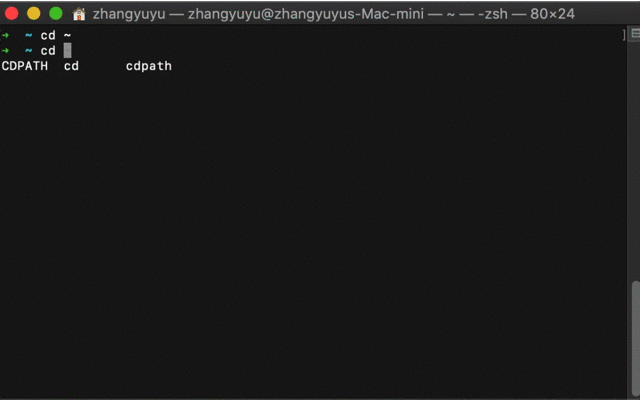

# Mac OS更换Shell为zsh
## 背景
在2019年WWDC期间，苹果推出了macOS Catalina，并且将zsh设置为操作系统默认shell。我最近因为新换了Macbook 16 2020，才发现默认shell的变化。
更改默认 Shell 的操作步骤：***系统偏好设置>用户与群组>高级设置>选择shell程序***
### bash
shell 俗称壳，是用来与 kernel 内核做区分，作用是给计算机使用者提供操作界面，与计算机内核进行交互。它接收用户命令，对命令做解析，然后调用系统中的应用。
shell 有很多种，这里介绍几个常见的shell。
第一个 Unix Shell 是1979年底在V7 Unix（AT&T第7版）中引入的，以它的资助者 Stephen Bourne 命名。Bourne shell 是一个交互式命令解释器和命令变成语言。
Bourne Again Shell （bash）是GNU计划的一部分，用来替代 Bourne shell。现在大多数Linux发行版都适用bash作为默认的shell。
### zsh
zsh 号称是「终极shell」，从这个称号看出来它的功能应该很强大
#### zsh具有以下主要功能：
- 开箱即用、可编程的命令行补全功能可以帮助用户输入各种参数以及选项
- 在用户启动的所有shell中共享命令历史。这一点非常棒，曾经因为sh无法很好的解决多个窗口共享历史命令的问题头疼了一阵儿
- 通过扩展的文件通配符，可以不利用外部命令达到find命令一般展开文件名
- 改进的变量与数组处理
- 在缓冲区中编辑多行命令
- 多种兼容模式，例如使用/bin/sh运行时可以伪装成Bourne shell
- 可以定制呈现形式的提示符；包括在屏幕右端显示信息，并在键入长命令时自动隐藏
- 可加载的模块，提供其他各种支持：完整的TCP与Unix域套接字控制，FTP客户端与扩充过的数学函数
- 完全可定制化
在使用了一段时间的zsh以后，我发现相比bash确实强大不少，但是其配置确实比较麻烦，好在有一个叫做[oh-my-zsh](https://github.com/ohmyzsh/ohmyzsh)的zsh配置，十分强大好用
## oh-my-zs安装与配置
### 安装
1. 命令安装

| Method    | Command                                                                                           |
|:----------|:--------------------------------------------------------------------------------------------------|
| **curl**  | `sh -c "$(curl -fsSL https://raw.githubusercontent.com/ohmyzsh/ohmyzsh/master/tools/install.sh)"` |
| **wget**  | `sh -c "$(wget -O- https://raw.githubusercontent.com/ohmyzsh/ohmyzsh/master/tools/install.sh)"`   |
| **fetch** | `sh -c "$(fetch -o - https://raw.githubusercontent.com/ohmyzsh/ohmyzsh/master/tools/install.sh)"` |
2. 手动安装
```
git clone https://github.com/robbyrussell/oh-my-zsh.git ~/.oh-my-zsh
cp ~/.oh-my-zsh/templates/zshrc.zsh-template ~/.zshrc
source ~/.zshrc
```
### 配置
zsh-autosuggestions 和 zsh-syntax-highlighting 是自定义安装的插件，可以用 git 将插件 clone 到指定插件目录下

还有一种安装方法是将插件下载下来，将插件文件放入～/.oh-my-zsh/plugins，并且重命名为**插件名.plug.zsh**，最新版的zsh定义了插件名称为<插件名.plug.zsh>，然后在~/.zshrc文件中的plugins属性中加入插件名
```
plugins=(
    git 
    zsh-autosuggestions
    incr
)
```

#### 自动提示插件
  ```git clone git://github.com/zsh-users/zsh-autosuggestions $ZSH_CUSTOM/plugins/zsh-autosuggestions```
#### 语法高亮插件
  ```git clone git://github.com/zsh-users/zsh-syntax-highlighting $ZSH_CUSTOM/plugins/zsh-syntax-highlighting```
#### 更新配置
  ```source ~/.zshrc```

需要其他插件的可以自行安装，如果插件未安装，开启终端的时候会报错，按照错误提示，安装对应的插件即可。
### 效果演示

